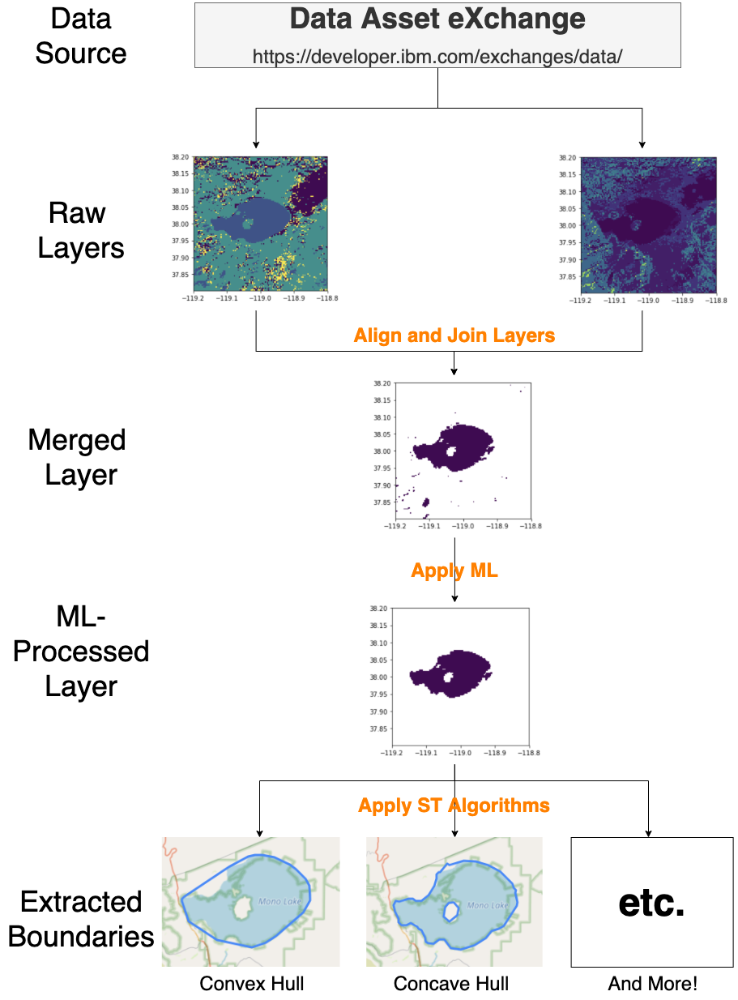

# Analyze Satellite Data with Watson Studio Native Spatiotemporal Capabilities

In this Code Pattern, we will utilize an example to demonstrate how to analyze satellite data to derive useful information and insights. This example uses “Dynamic Surface Water Extent” data from Landsat and, by using Watson Studio's Spatiotemporal and ML capabilities, shows how to get useful insights like extracting the area boundary of surface water. In order to achieved this, the notebook also demonstrates a set of useful operations in this domain (e.g. spatial alignment and spatial aggregation), all of which can be generalized and used towards any satellite data. Therefore, this code pattern can be served as a template that can be followed to study any satellite data, e.g. study what and how regions are affected by wildfire for insurance industry by analyzing satellite data before and after the wildfire event, study vegetation management by analyzing vegetation index from satellite data.

When you completed this Code Pattern, you will understand how to:

* Use Notebooks in [IBM Watson Studio](https://dataplatform.cloud.ibm.com/) to analyze satellite imagery data
* Align and join satellite data from different layers with arbitrary resolution
* Easily visualize processed satellite data in notebook
* Run ML on satellite data
* Use [Watson Studio's native Spatiotemporal Library](https://cloud.ibm.com/docs/services/AnalyticsEngine?topic=AnalyticsEngine-geospatial-geotemporal-lib) to do further spatiotemporal analysis

The intended audience for this Code Pattern is domain developers and end users who wish to learn how to analyze satellite data efficiently.

## Flow

1. Load "Vectorized Dynamic Surface Water Extent" data from [DAX](https://developer.ibm.com/exchanges/data/all/mono-lake-surface-water-extent-landsat8-data/).
2. Align and join two layers from the data to generate a derived layer.
3. Apply ML on the derived layer to improve the accuracy.
4. Apply spatiotemporal analysis and transformations to further improve the accuracy and derive insight.
5. Visualize results from each step.

## Included technologies

* [DAX](https://developer.ibm.com/exchanges/data/all/mono-lake-surface-water-extent-landsat8-data/): an online hub for developers and data scientists to find carefully curated free and open datasets under open data licenses
* [IBM Watson Studio](https://www.ibm.com/cloud/watson-studio): Analyze data using a PySpark Env in Watson Studio.
* [Cloud Native Spatiotemporal Library](https://cloud.ibm.com/docs/services/AnalyticsEngine?topic=AnalyticsEngine-geospatial-geotemporal-lib): A spatiotemporal library, natively available in IBM Cloud products (Watson Studio, HummingBird, IAE, CP4D, etc.), which provides all various of functionalities for spatiotemporal analysis.
* [Pyrip]([https://pypi.org/project/pyrip/](https://pypi.org/project/pyrip/)): Python library for raster image processing, which wraps and re-writes some key functionalities from GDAL and rasterio for better performance.

## Prerequisites

* An account on IBM Cloud to access [Watson Studio](https://www.ibm.com/cloud/watson-studio)

## Steps

The [notebook](notebooks/Spatiotemporal_Analysis_on_Satellite.ipynb) is all you need to run the demo. If you are familiar with Watson Studio and how to import an existing notebook, you can skip this part and simply import the [notebook](notebooks/Spatiotemporal_Analysis_on_Satellite.ipynb) into any project you have and just run it.  

Follow below steps if you are not familiar with Watson Studio:

1. [Sign up for the Watson Studio](#1-sign-up-for-watson-studio)
2. [Create the notebook](#2-create-the-notebook)
3. [Run the notebook](#3-run-the-notebook)

### 1. Sign up for Watson Studio

Sign up for IBM's [Watson Studio](https://dataplatform.cloud.ibm.com/).

### 2. Create the notebook

[Create a notebook](https://dataplatform.cloud.ibm.com/docs/content/wsj/analyze-data/creating-notebooks.html) with this template.

You can either download the [notebook](notebooks/Spatiotemporal_Analysis_on_Satellite.ipynb) and import it using `From file` tab or get the raw github link of the [notebook](notebooks/Spatiotemporal_Analysis_on_Satellite.ipynb) and import it using `From URL` tab.

### 3. Run the notebook

Run the notebook cell by cell. 

> NOTE: with a free pyspark env on WS, some cells might take a while to run due to limited computation resouces.

## Sample Output

You can check the snapshot of sample output from either [Github](notebooks/Spatiotemporal_Analysis_on_Satellite.ipynb) or 
[Watson Studio View-Only Link](https://dataplatform.cloud.ibm.com/analytics/notebooks/v2/b635a904-1f83-408d-a4fd-3c51ae421bdd/view?access_token=13bd19026fb4800ee5179951bbd681807bdf50580f6dd55f37c1c6302edbe8b8)

> Note: Interactive map(s) won't render in the github page. To view those map(s), either run the notebook yourself or check it on Watson Studio using above link.

## License

This code pattern is licensed under the Apache Software License, Version 2.  Separate third party code objects invoked within this code pattern are licensed by their respective providers pursuant to their own separate licenses. Contributions are subject to the [Developer Certificate of Origin, Version 1.1 (DCO)](https://developercertificate.org/) and the [Apache Software License, Version 2](https://www.apache.org/licenses/LICENSE-2.0.txt).

[Apache Software License (ASL) FAQ](https://www.apache.org/foundation/license-faq.html#WhatDoesItMEAN)
